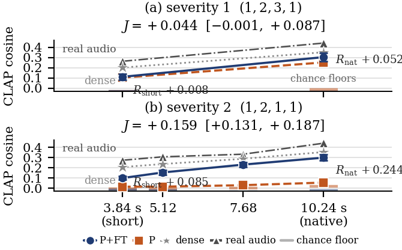
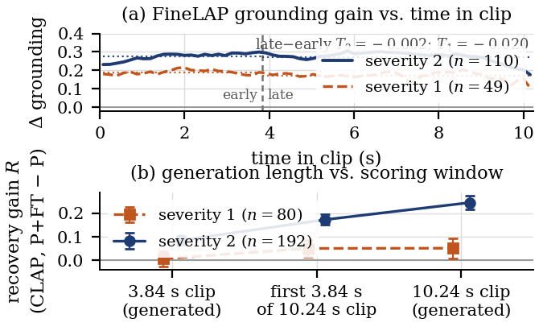

# Recovery Fine-Tuning Recovers Where It Was Trained: Duration- and Domain-Dependent Gains in Pruned Text-to-Audio Diffusion

Research code, pre-registrations, provenance and results for an evaluation study of **structured
pruning followed by recovery fine-tuning** in text-to-audio latent diffusion, using the released
pruned and fine-tuned [AudioLDM](https://arxiv.org/abs/2301.12503)-M checkpoints of
[Singh et al.](https://arxiv.org/abs/2607.13330) as a controlled case study. The repository name
records the hypothesis the project started from (modality-swap-aware pruning), which was rejected
at its pre-registered gates (§4); the paper that came out of the project is the one described here.

## Abstract

Structured pruning of text-to-audio diffusion models is followed by recovery fine-tuning, whose
benefit is usually certified by one score at one inference setting. Using the released pruned and
fine-tuned AudioLDM-M checkpoints at two pruning severities (65 % and 83 % of U-Net parameters
removed), we measure the paired recovery gain in text–audio alignment across clip duration and
prompt domain, anchored by a shuffled-caption chance floor and the real audio of the same prompts.
At 83 % pruning, fine-tuning closes 63 % of the pruned checkpoint's gap to real audio at its own
10.24 s fine-tuning duration but only 33 % at 3.84 s, and nothing on held-out hip-hop captions;
against the unpruned model, 82 % versus 44 % at 83 % and 52 % versus 8 % at 65 %. The duration
dependence was pre-specified, replicates on a disjoint prompt set, survives a family-wise
correction, is not a scorer artefact, grows monotonically over four durations, holds at the
published sampler recipe, and is reproduced at both durations by a second scorer and by two
event-level metrics outside the CLAP family. Recovery should be reported across operating points;
lacking a matched dense fine-tuned control and human ratings, our claims concern evaluation, not
mechanism.

The evaluated checkpoints are the **object of study, not an adversary**: this is an
evaluation-methodology study, nothing is trained here, and no claim of error or misconduct is made
anywhere in this repository. Two of the manuscript's authors released the evaluated checkpoints;
the operating points, batteries, estimands and gates were specified independently of that work.

Manuscript (ICASSP 2027 format, Overleaf-ready): [`icassp/icassp_operating_point.tex`](icassp/icassp_operating_point.tex)
· [PDF](icassp/icassp_operating_point.pdf) · audio examples:
[gbibbo.github.io/audioldm-modality-swap-pruning](https://gbibbo.github.io/audioldm-modality-swap-pruning).

---

## Overview

### Systems under study

Released checkpoints of the same text-to-audio latent diffusion model, verified provenance,
**no retraining performed by us**:

| System | Definition | U-Net parameters |
|---|---|---|
| **dense** | AudioLDM-M-Full (public release; itself AudioCaps-fine-tuned by its authors) | 415.96 M |
| **P, severity 1** | released L1 channel selection at the `(1,2,3,1)` budget applied to the dense EMA weights (bit-exact to the released raw weights); pure prune-and-merge, never fine-tuned | 145.67 M (−65.0 %) |
| **P+FT, severity 1** | the same budget after the released 10⁶-step AudioCaps recovery fine-tune (EMA) | 145.67 M |
| **P, severity 2** | `(1,2,1,1)` budget; the release differs from the dense-EMA selection in three decoder-seam tensors, so both conventions are evaluated (A′ primary, B′ sensitivity) | 71.08 M (−82.9 %) |
| **P+FT, severity 2** | the released recovery fine-tune at `(1,2,1,1)` (EMA) | 71.08 M |

"Recovery" names the fine-tuning stage, not an achieved restoration.

### The question

Does the gain of recovery fine-tuning over the pruned checkpoint depend on the operating point at
which it is evaluated? Operating points: clip **duration** (3.84 s, and — at severity 2 — 5.12,
7.68 and the native 10.24 s, the fine-tuning duration), prompt **domain** (in-domain AudioCaps
versus held-out hip-hop/rap captions from MusicCaps), and the **sampler recipe** (the frozen DDIM-50
/ guidance-2.5 setting versus the published DDIM-200 / guidance-3.5 one). Every score is read
against two anchors: a shuffled-caption **chance floor** and the **real audio** of the same prompts.

### Findings

1. **Duration.** The recovery gain is several times larger at the fine-tuning duration than at
   3.84 s, at both severities (severity 2: R = +0.085 → +0.244, interaction J = +0.159
   [+0.131, +0.187], pre-specified gate passed on a disjoint 192-prompt set). A four-point sweep
   shows the gain **growing monotonically** with duration — R = +0.085, +0.139, +0.201, +0.244 at
   3.84, 5.12, 7.68, 10.24 s, every step resolved — while the pruned checkpoint stays flat to
   5.12 s. It is not a scale or scorer effect: the chance floor moves by at most 0.025 between
   durations and the interaction survives chance correction (J_c = +0.191 [+0.162, +0.220]).
2. **Domain.** At matched duration the gain is present in-domain and absent or negative on the
   held-out hip-hop captions — at both severities at 3.84 s and at both durations at severity 2 —
   where alignment after fine-tuning sits 0.02–0.03 above the chance floor, against 0.32 in-domain.
3. **Recovery ratios, not one restored score.** At 83 % pruning, fine-tuning closes 44 / 63 / 78 /
   82 % of the gap to the unpruned model at 3.84 / 5.12 / 7.68 / 10.24 s and 33 / 48 / 66 / 63 % of
   the gap to real audio; P+FT is not restored to dense at any duration (dense leads by +0.055
   [+0.021, +0.088] at 10.24 s). At 65 %: 8 % versus 52 % of the gap to dense.
4. **Where the gain lives.** A frame-level grounding model (FineLAP) shows the native-duration gain
   spread uniformly over the clip, not back-loaded; a crop analysis shows the short-duration deficit
   arises from *generating* short clips, not from scoring short excerpts.
5. **Robustness.** The duration interaction holds at the published sampler recipe (DDIM 200 /
   guidance 3.5, 64-prompt subset: J = +0.184 [+0.126, +0.243]); it is reproduced by Human-CLAP and
   by two event-level metrics outside the CLAP family (KL to real references, PANNs top-10 capture)
   at both durations; every severity-2 conclusion survives a Holm correction over 19 contrasts. On
   the four-point sweep the three corroborating scorers also show R rising at every step, with the
   first two steps resolved and the last (7.68 → 10.24 s) not — Human-CLAP is flat there (+0.004
   [−0.033, +0.041]) — so off the primary scorer most of the gain has accrued by 7.68 s
   (`configs/research/draft5_sweep_hc.json`, `draft5_sweep_secondary_metrics.json`, post-hoc).
6. **Pre-specified negatives, kept.** A "trade in-domain for out-of-domain alignment" account
   fails (severity 1 has no in-domain gain at 3.84 s); the severity-1 music penalty did not
   replicate at severity 2; a "late allocation" account of the duration effect is rejected by
   FineLAP; and the two hypotheses the project started from were rejected at their own gates (§4).

**Limitations, as declared in the paper.** One model family, two severities, two domains.
Mechanistic attribution is blocked: the matched control (the dense model given the same AudioCaps
fine-tune) no longer exists, so the dependence cannot be attributed to pruning rather than to
fine-tuning in general. Primary inference rests on CLAP-family scorers; there is no human
evaluation. Best-of-3 selection of the published recipe was not reproduced. The duration sweep
stops at the fine-tuning duration, so it cannot separate "largest at the training duration" from
"larger for longer clips".

---



**Fig. 1.** The recovery gain grows with clip duration. Mean CLAP cosine of the pruned (P, dashed)
and fine-tuned (P+FT, solid) checkpoints, (a) severity 1 at the short and native points, (b)
severity 2 at four durations; whiskers: 95 % CI of the paired gain R. Anchors: real audio of the
same prompts (triangles), each cell's chance floor (ticks) and the matched dense control (stars).



**Fig. 2.** (a) FineLAP frame-level grounding gain (P+FT − P) versus time in the 10.24 s clip:
uniform, not back-loaded. (b) Recovery gain R on the generated 3.84 s clip, the first 3.84 s of the
10.24 s clip and the full clip: a generation-length, not a scoring-window, effect. Both figures are
regenerated from committed result artifacts by
[`scripts/research/paper_figs/make_draft5_figs.py`](scripts/research/paper_figs/make_draft5_figs.py).

### Project status (2026-09-04)

The manuscript is complete in the ICASSP 2027 format (4 content pages + references) and every
number it prints is reproduced from a committed artifact by
[`verify_draft5_numbers.py`](scripts/research/paper_figs/verify_draft5_numbers.py). Paid GPU work
is closed after the duration sweep and the published-recipe check (two T4 jobs, 4.558 credits).
A blinded six-listener expert perceptual panel is designed, powered, loudness-normalised and
platform-built but **not launched** (§5); it remains the one corroboration the paper lacks.

---

## Extended description

<details open>
<summary><b>1. Experimental design and statistical methodology</b></summary>

The methodological contribution is the evaluation design rather than a pruning criterion.
Aggregate benchmark tables over compressed generative models conceal precisely the interactions
reported above. The design therefore specifies:

* **Common random numbers.** For each prompt, the initial latent `x_T` is a deterministic
  function of `(ytid, replicate)` under a fixed salt and is *shared across the compared systems*,
  so between-system differences are not confounded with sampling noise.
* **Prompt as the unit of analysis.** Replicates are averaged within prompt, and inference
  proceeds by **prompt-clustered percentile bootstrap** (B = 10 000, PCG64, recorded seed) over
  prompts rather than over clips, which would overstate the effective sample size.
* **Paired contrasts throughout.** Every reported estimand has the form
  `mean_i [ score(recovered, i) − score(pruned, i) ]` with its interval; unpaired comparisons of
  aggregate scores are not used.
* **Revision-pinned scorers.** The CLAP checkpoint revision, batching order and RNG convention
  are part of the endpoint definition, since they measurably perturb the score.
* **Pre-registration.** Protocols, prompt manifests, gates, smallest effect sizes of interest and
  decision rules are written to disk, SHA-256 stamped and committed *before* generation; result
  artifacts record the protocol hash under which they were produced. Gates are honoured when they
  fail (§4).
* **Power analysis preceding compute.** Minimum detectable effects and CPU power simulations are
  computed before authorising a GPU job, so that a null outcome is interpretable rather than
  merely underpowered.

</details>

<details open>
<summary><b>2. Results</b></summary>

All numbers below are those printed in the manuscript and are reproduced from committed artifacts
(`configs/research/*.json`) by `verify_draft5_numbers.py`. CLAP = fused CLAP cosine
(`laion/clap-htsat-fused`, rev. 365dea6e); R = CLAP(P+FT) − CLAP(P), paired per prompt, 95 %
prompt-level percentile-bootstrap intervals (B = 10⁴); W = fraction of prompts on which P+FT beats P.
DDIM 50, guidance 2.5, η = 0, fp32, single generation, EMA weights, common generation noise per
prompt across the compared systems.

**Table 1 — recovery gain in CLAP alignment.**

| Setting | P | P+FT | R [95 % CI] | W |
|---|---|---|---|---|
| *Severity 1, (1,2,3,1)* | | | | |
| AudioCaps 3.84 s (n = 80) | 0.104 | 0.111 | +0.008 [−0.023, +0.039] | 0.44 |
| AudioCaps 10.24 s (n = 80) | 0.253 | 0.304 | **+0.052** [+0.009, +0.093] | 0.64 |
| music 3.84 s (n = 64) | 0.117 | 0.023 | **−0.094** [−0.124, −0.065] | 0.20 |
| duration s(·); J | +0.149 | +0.193 | +0.044 [−0.001, +0.087] | |
| domain 3.84 s (n = 96) | | | **+0.092** [+0.054, +0.131] | |
| *Severity 2, (1,2,1,1)* | | | | |
| AudioCaps 3.84 s (n = 192) | 0.015 | 0.100 | **+0.085** [+0.066, +0.105] | 0.72 |
| AudioCaps 5.12 s (n = 192) | 0.015 | 0.154 | **+0.139** [+0.115, +0.164] | 0.79 |
| AudioCaps 7.68 s (n = 192) | 0.029 | 0.231 | **+0.201** [+0.175, +0.227] | 0.89 |
| AudioCaps 10.24 s (n = 192) | 0.055 | 0.299 | **+0.244** [+0.215, +0.273] | 0.87 |
| music 3.84 s (n = 64) | 0.005 | 0.014 | +0.009 [−0.013, +0.032] | 0.48 |
| music 10.24 s (n = 64) | 0.089 | 0.094 | +0.005 [−0.028, +0.039] | 0.53 |
| duration s(·); J (3.84 → 10.24 s) | +0.040 | +0.200 | **+0.159** [+0.131, +0.187] (pre-specified gate passes) | |
| domain 3.84 s | | | **+0.076** [+0.047, +0.105] | |
| domain 10.24 s | | | **+0.239** [+0.195, +0.283] | |

Sweep steps at severity 2 (pre-specified shape rule → *monotone increasing*): D1 = +0.054
[+0.032, +0.077], D2 = +0.062 [+0.037, +0.087], D3 = +0.043 [+0.013, +0.073]. Published sampler
recipe (DDIM 200 / guidance 3.5, first 64 prompts, pre-specified gate lo95(J) > 0): J = +0.184
[+0.126, +0.243]; the frozen recipe on the same prompts gives +0.168 (difference +0.016
[−0.040, +0.072], descriptive). Every severity-2 conclusion survives a Holm correction over the
19-contrast family (`configs/research/draft5_holm_extension.json`).

**Table 2 — anchors and recovery ratios.** Chance floor of the P / P+FT cells (shuffled captions
from the same embeddings), mean CLAP of the real AudioCaps audio of the same prompts, and the
fraction ρ of the pruned checkpoint's gap to dense and to real audio closed by fine-tuning.

| Setting | floor P / P+FT | real | ρ_dense [%] | ρ_real [%] |
|---|---|---|---|---|
| sev. 1 AC 3.84 s | −0.031 / −0.033 | 0.264 | 8 [−30, 36] | 5 [−16, 24] |
| sev. 1 AC 10.24 s | −0.012 / −0.036 | 0.442 | 52 [11, 103] | 27 [6, 46] |
| sev. 2 AC 3.84 s | −0.005 / −0.015 | 0.274 | 44 [36, 53] | 33 [26, 39] |
| sev. 2 AC 5.12 s | −0.005 / −0.025 | 0.307 | 63 [52, 74] | 48 [40, 55] |
| sev. 2 AC 7.68 s | +0.003 / −0.037 | 0.333 | 78 [68, 88] | 66 [59, 74] |
| sev. 2 AC 10.24 s | +0.020 / −0.022 | 0.440 | 82 [72, 92] | 63 [56, 71] |
| sev. 1 music 3.84 s | +0.055 / +0.001 | – | – | – |
| sev. 2 music 3.84 s | −0.013 / −0.004 | – | – | – |
| sev. 2 music 10.24 s | +0.070 / +0.061 | – | – | – |

The matched dense control separates the systems' duration response from the scorer's: at
severity 2 the dense model's response s(dense) = +0.147 [+0.117, +0.177] (0.207 → 0.354) sits
between the pruned checkpoint's (−0.107 [−0.137, −0.076] below it) and the fine-tuned checkpoint's
(+0.053 [+0.017, +0.089] above it). ρ_real dips at 10.24 s only because the real clip itself gains
+0.108 once it fills the scorer's 10 s window without repeat-padding.

**Corroboration outside the primary scorer (severity 2).** Human-CLAP: R_nat = +0.375
[+0.340, +0.408], J = +0.185. Event-level metrics against the real references of the same prompts:
KL 2.23 vs 4.45 (Δ = +2.22 [+1.93, +2.53]) and PANNs top-10 captured labels 1.46 vs 0.60
(Δ = +0.86 [+0.70, +1.02]) at 10.24 s; rescored at 3.84 s both gains shrink (KL +0.66
[+0.42, +0.92], PANNs +0.19 [+0.06, +0.32]), so the interaction holds outside the CLAP family
(J_KL = +1.56 [+1.19, +1.92], J_PANN = +0.67 [+0.49, +0.86]). FAD agrees descriptively (6.92 vs
27.4).

**Where the gain lives.** FineLAP frame-level grounding: the P+FT − P gain is spread over the whole
10.24 s clip (semantic mass +0.27 [+0.22, +0.33]; D_early = +0.275 vs D_late = +0.273,
T = −0.002 [−0.024, +0.020]), rejecting a "late allocation" account. Crop analysis: scoring the
first 3.84 s of each 10.24 s generation gives R_crop = +0.172 [+0.150, +0.194] at severity 2,
+0.087 above the separately generated 3.84 s clips — the short-duration deficit is a generation
effect, not a scoring-window effect.

</details>

<details>
<summary><b>3. Baseline reproduction and provenance</b></summary>

The published baseline was reproduced from artifacts rather than from prose before any new
experiment was run:

* **Bit-exact reconstruction, 690/690 tensors.** From the base AudioLDM-M-Full weights and the
  published ranking file, the materializer reconstructs the released `(1,2,3,1)` checkpoint tensor
  for tensor.
* **The released pruned artifact is pre-recovery.** All 2061 same-shape tensors are bit-identical
  to the base model, establishing pure prune-and-merge output and validating its use as the
  `pruned-only` control.
* **Closed provenance chain.** The base checkpoint carries identical md5 in the official AudioLDM
  Zenodo record and in the pruning record; all public artifacts are fetched and md5-verified by
  script.
* **Structural compatibility of the recovered checkpoint** was audited independently: identical
  layout (2299 keys, zero shape mismatches), strict U-Net load 690/690, and fine-tuning confined
  to the U-Net and its EMA — the VAE and CLAP conditioner are byte-identical to the dense release,
  so the conditioning pathway is unchanged between the compared systems.
* **An open question regarding pruning direction.** The released artifact retains, per pruned
  layer, the filters of *lowest* L1 magnitude, inverting the conventional
  [magnitude criterion](https://arxiv.org/abs/1608.08710); Spearman = −1.000000 between the
  released ranking and a conventional L1 ranking across all 28 ranked layers. This is **not
  asserted to be an error** — it may be deliberate or reflect a convention we have not
  reconstructed, and the question stands with the original authors. Since the baseline *is* that
  artifact, its convention is reproduced exactly and conventional keep-highest-L1 is reported
  alongside, so that criterion *direction* and criterion *quality* are never conflated.
  Write-up: [`l1_pruning_direction_finding.md`](docs/m0_baseline_reproduction/l1_pruning_direction_finding.md).

</details>

<details>
<summary><b>4. Pre-registered negative results</b></summary>

**Modality-swap-aware pruning — rejected at both gates.** AudioLDM is trained conditioned on a
CLAP *audio* embedding and sampled conditioned on a CLAP *text* embedding; both enter the U-Net
through the same `[B, 1, 512]` FiLM interface, verified by test rather than assumed from the
paper. The hypothesis was that structured pruning damages the two conditioning pathways
asymmetrically, and that a paired audio+text Taylor criterion would consequently prune better at
matched gradient-evaluation budget.

* **Gate A — modality-dependent damage against a matched random-mask null** (20 pre-registered
  masks): Δ_swap = 0.0007, CI95 [−0.0025, +0.0028]. The null is matched *at equal generic damage*
  by regressing `R_mod ~ f(D_gen)` across the random controls and taking the residual, so an
  effect counts only if it survives the fact that random pruning inflicts more generic damage
  overall. **FAIL.**
* **Gate B — paired versus faithful text-only Taylor saliency at matched budget:** weighted
  kept-set overlap 0.9475 against a ≤ 0.80 threshold, with mean per-layer
  ρ(S_audio, S_text) = 0.980 against a discriminating control ρ(S_audio, L1) = 0.571. The two
  saliencies are near-identical, so the paired criteria collapse onto text-only. **FAIL at the
  saliency stage, before generation compute was committed.**

**Differential legacy-adapter fragility — refuted by its own falsifier.** A subsequent thesis
held that pruning may preserve standalone generation quality while disproportionately destroying
the utility of a [LoRA](https://arxiv.org/abs/2106.09685) adapter trained on the *dense* backbone
and transferred by deterministic mask-induced slicing (no adapter retraining, no access to adapter
training data). Gate 0 passed: the dense-trained adapter uplift replicates on the target backbone,
ΔCLAP = +0.0464 [+0.0221, +0.0720], n = 64 held-out prompts. The pre-registered falsifier then
failed its dual gate — standalone non-inferiority is violated (E = 0.174 [0.145, 0.204], far
exceeding the 0.025 margin), so the observed differential fragility (D = 0.044 [0.019, 0.069])
cannot be separated from generic capacity loss. **Phenomenon FALSE; pre-registered stop, no rescue
experiment.** The transfer algebra survives as reusable infrastructure:
`B'A' = (BA)[K_out, K_in]` holds exactly for Linear and Conv layers, bit-exact in fp32 and fp16,
with exact nested-ladder composition
([`test_lora_mask_transfer.py`](tests/research/test_lora_mask_transfer.py)).

Both closures, and the permissible paper wording for each, are recorded in
[`docs/claims_matrix.md`](docs/claims_matrix.md).

</details>

<details>
<summary><b>5. Perceptual evaluation protocol (frozen, not launched)</b></summary>

Model-based scores are not perceptual measurements, so the intended corroboration is a blinded
expert panel, designed after the computational results were known but **prospectively frozen
before any human data collection**:

* 540 previously generated waveforms, all SHA-256 reconciled against their manifests with seeds
  paired across systems; no new generation and no GPU.
* Design selected by CPU power simulation (D1: 80 prompts × 1 rater × 2 durations dominates
  40 × 2 on every scenario and endpoint). H1 (`A_native`) is well powered, MDE₈₀ ≈ 0.35 on a
  ±2 comparative scale; H2, the perceptual analogue of the duration interaction, is powered only
  for a sizeable interaction, which is declared in advance so that a null H2 is *inconclusive*
  rather than evidence of absence.
* Loudness normalisation per [ITU-R BS.1770-4](https://www.itu.int/rec/R-REC-BS.1770). The
  conventional −23 LUFS target proved **infeasible**: 92 files would clip, because near-silent
  failed-pruned outputs drive crest factors to ≈34 dB and those items must *not* be excluded, as
  they constitute the phenomenon under study. The frozen target is −36.0 LUFS with a −1 dBFS
  ceiling, applied as a single fixed gain with no limiting, yielding zero unsafe items.
* Estimands, scale mapping, bootstrap procedure and stopping rule are frozen in
  [`docs/listening_study_protocol.md`](docs/listening_study_protocol.md); assignments are frozen
  and blinded; post-freeze audio-bundle QA passes 68/68. Unblinding keys and audio are excluded
  from version control.

</details>

<details>
<summary><b>6. Implementation and compute methodology</b></summary>

* **Environment** rebuilt from an unmodified frozen `poetry.lock`: 155 packages, no pin relaxed
  (`torch 1.13.1+cu117`, `transformers 4.30.2`, `pytorch-lightning 2.1.1`, `numpy 1.23.5`), on a
  `uv`-provisioned standalone CPython 3.10.20. See
  [`docs/environment_report.md`](docs/environment_report.md).
* **Upstream AudioLDM is vendored unmodified** except for a single deliberate, reviewed patch
  (1 file, +16/−2): gradient checkpointing differentiates with respect to frozen parameters, which
  is incompatible with parameter-efficient recovery. The patch is auditable with
  `git diff upstream-frozen -- audioldm_train/` and justified in the ledger under `DECISION-F10`.
* **`audioldm_peft/`** implements parameter-efficient recovery: LoRA Linear/Conv2d with bit-exact
  merge and unmerge, an order-safe injector guarded by `assert_peft_ready`, EMA, and exact
  optimizer and training-state resume. Injection wraps 284 modules on the real pruned U-Net
  (185 Linear + 99 Conv2d), numerically invariant to 1.0 × 10⁻⁷ on a real forward pass. **LoRA is
  not claimed as a contribution**: with biases and GroupNorm affine parameters also trainable the
  mechanism is termed *parameter-efficient recovery*, and the budget is reported decomposed rather
  than as a single headline figure — LoRA 3,718,784 · bias 108,680 · GroupNorm affine 48,768 ·
  **3,876,232 trainable of 149,392,648 total**.
* **CPU-first compute policy.** GPU execution is reserved for computations that genuinely require
  CUDA, i.e. waveform generation. CLAP, Human-CLAP, PANNs, FAD and FD scoring, every bootstrap and
  verdict, all manifest and SHA validation, and all checkpoint inspection execute on CPU at zero
  credit cost, in stages explicitly split from the GPU pipeline.
* **Per-job compute accounting.** A single NVIDIA T4, ephemeral cloud jobs launched only from a
  clean, committed, pushed tree behind a fail-fast preflight (commit / working tree / checkpoint /
  CUDA / manifest SHA). Settled costs are recorded in
  [`docs/compute_budget.md`](docs/compute_budget.md) — e.g. the severity-2 replication at 3.688
  credits (≈208 min of T4 generation), the duration discriminator at 0.577, the adapter chain at
  4.55, the severity-2 dense control at 1.263, the duration sweep at 2.645 and the published-recipe
  check at 1.913 — including the runs that failed and the reason (a preempted job, a dirty-tree
  refusal, an out-of-funds termination mid-generation). Every generation job is followed by a
  device-consistency check (four clips regenerated and compared with the frozen ones: reproducible
  to within 1 int16 LSB across T4 jobs, ΔCLAP ~ 10⁻⁶).
* **27 CPU test modules** behind a single command, covering the LoRA algebra, mask-induced
  slicing, channel-multiplier materialization, the conditioning paths, the random-mask null, the
  Gate-B statistic, the clustered bootstrap, the power simulations and the manifest validator.

</details>

---

## Reproducibility

Each claim above is backed by an executable command.

```bash
# full research test suite (CPU, 27 modules, all passing)
OPENBLAS_CORETYPE=Haswell .venv/bin/python scripts/research/run_research_tests.py --all

# regenerate the manuscript figures from the committed result artifacts
OPENBLAS_CORETYPE=Haswell .venv/bin/python scripts/research/paper_figs/make_draft5_figs.py

# check that every number printed in the manuscript is reproduced from a committed artifact
OPENBLAS_CORETYPE=Haswell .venv/bin/python scripts/research/paper_figs/verify_draft5_numbers.py

# severity-2 primary verdict, dense control, sweep and published-recipe verdicts (CPU; WAVs on disk)
OPENBLAS_CORETYPE=Haswell .venv/bin/python scripts/research/xsev_score_verdict.py
OPENBLAS_CORETYPE=Haswell .venv/bin/python scripts/research/draft5_opsweep_verdict.py --exp sweep --verdict
OPENBLAS_CORETYPE=Haswell .venv/bin/python scripts/research/draft5_opsweep_verdict.py --exp pubrecipe --verdict

# bit-exact reconstruction of the released pruned checkpoint
.venv/bin/python scripts/research/verify_l1_bitexact.py

# pruning-direction finding (Spearman = -1 against a conventional L1 ranking)
.venv/bin/python scripts/research/verify_l1_direction.py

# audio and text conditioning reach the same FiLM interface
.venv/bin/python tests/research/test_conditioning_paths.py

# exact mask-induced LoRA slicing: B'A' == (BA)[K_out, K_in]
.venv/bin/python tests/research/test_lora_mask_transfer.py

# review every local patch applied to upstream code
git diff upstream-frozen -- audioldm_train/
```

Public checkpoints and the AudioCaps corpus are fetched and md5-verified by
`bash scripts/research/fetch_public_artifacts.sh`; they are not redistributed here.

## Repository structure

```text
audioldm_train/     upstream AudioLDM, one reviewed patch (DECISION-F10)
audioldm_peft/      parameter-efficient recovery: LoRA, injector, EMA, exact resume
research_pruning/   diagnostics/ · taylor/ · paired_modality/ · eval/ · lora_mask_transfer
scripts/research/   reproducible entrypoints, verification scripts, figure builders
tests/research/     CPU test suite (27 modules; stdlib runner, pytest is not in the lock)
configs/research/   frozen manifests, pre-registrations, SHA-stamped result artifacts
listening_study/    static blinded listening platform (audio and keys excluded from VCS)
docs/               execution contract, protocols, ledger, claims matrix, budget, audits, draft
data/ artifacts/ _external/                                            [not versioned]
```

Documents carrying the project state:

* [`docs/master_plan_v4.md`](docs/master_plan_v4.md) — the scientific execution contract
* [`docs/claims_matrix.md`](docs/claims_matrix.md) — every candidate claim, its status and the
  exact wording the evidence permits
* [`docs/experiment_ledger.md`](docs/experiment_ledger.md) — every experiment and gate, including
  the failed and stopped runs
* [`docs/compute_budget.md`](docs/compute_budget.md) — measured throughput, VRAM, GPU-hours, cost
* [`icassp/icassp_operating_point.tex`](icassp/icassp_operating_point.tex) — the manuscript
  (`icassp/MANUSCRIPT_NOTES.md` records every editorial decision; `icassp/README_OVERLEAF.md` the
  upload procedure)
* [`docs/review/`](docs/review/) — hostile-review rounds and the external-reviewer simulation with
  its action list
* [`PROGRESS.md`](PROGRESS.md) — living state

## Frozen upstream references

| Reference | Commit | Preserved as |
|---|---|---|
| [`haoheliu/AudioLDM-training-finetuning`](https://github.com/haoheliu/AudioLDM-training-finetuning) | `702a638d023b008a2d9a45cdf1e1f4fcdc590dfc` | branch `upstream-frozen`, merged into `main` |
| [`Arshdeep-Singh-Boparai/PruningAudioLDM`](https://github.com/Arshdeep-Singh-Boparai/PruningAudioLDM) | `6f65f628fabc4ad27770753698fc81944e820f9f` | branch `pruning-reference-frozen` |

This work builds directly on both. The pruning baseline, the published `(1,2,3,1)` checkpoint, the
recovered checkpoint and the layer ranking are Arshdeep Singh's
([Zenodo 10.5281/zenodo.21376822](https://doi.org/10.5281/zenodo.21376822), superseded by record
21977996); AudioLDM is Haohe Liu's.

## References

Text-to-audio generation and evaluation — AudioLDM
([2301.12503](https://arxiv.org/abs/2301.12503)), LAION-CLAP
([2211.06687](https://arxiv.org/abs/2211.06687)), PANNs
([1912.10211](https://arxiv.org/abs/1912.10211)), Fréchet Audio Distance
([1812.08466](https://arxiv.org/abs/1812.08466)), AudioCaps (Kim et al., NAACL 2019), HiFi-GAN
([2010.05646](https://arxiv.org/abs/2010.05646)).
Diffusion sampling — DDIM ([2010.02502](https://arxiv.org/abs/2010.02502)), classifier-free
guidance ([2207.12598](https://arxiv.org/abs/2207.12598)).
Pruning, quantization and compression of diffusion models — L1 filter pruning
([1608.08710](https://arxiv.org/abs/1608.08710)), Taylor importance
([1906.10771](https://arxiv.org/abs/1906.10771)), Diff-Pruning
([2305.10924](https://arxiv.org/abs/2305.10924)), BK-SDM
([2305.15798](https://arxiv.org/abs/2305.15798)), PTQD
([2305.10657](https://arxiv.org/abs/2305.10657)), MixDQ
([2405.17873](https://arxiv.org/abs/2405.17873)), Q-Sched
([2509.01624](https://arxiv.org/abs/2509.01624)), and the AudioLDM pruning work under study
([2607.13330](https://arxiv.org/abs/2607.13330)).
Parameter-efficient adaptation — LoRA ([2106.09685](https://arxiv.org/abs/2106.09685)).

## License and data availability

Upstream code is MIT. Pretrained AudioLDM checkpoints are **CC-BY-NC-4.0 (non-commercial)** per
the upstream README and are **not** redistributed here; the fetch script retrieves them from their
original records and verifies md5. Upstream usage instructions are preserved verbatim in
[`UPSTREAM_README.md`](UPSTREAM_README.md).
