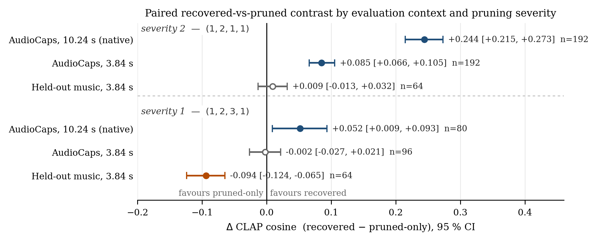
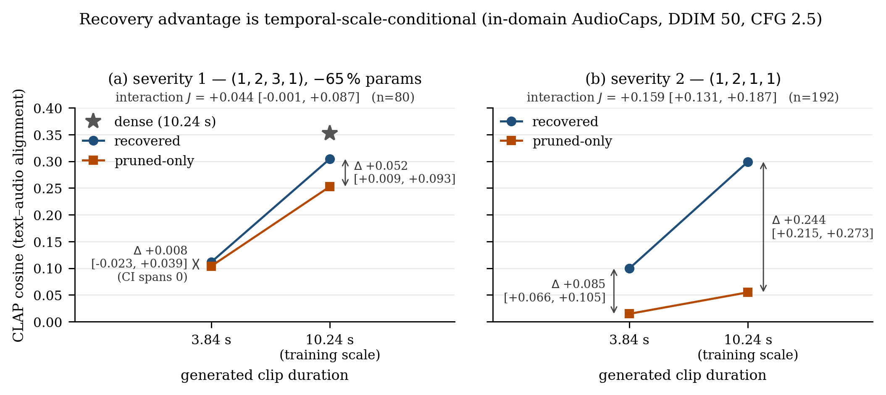

# What Does Post-Pruning Recovery Restore in a Conditional Diffusion Model? A Controlled Paired Evaluation of AudioLDM

Research code, pre-registrations, provenance and results for a study of **structured pruning and
recovery fine-tuning** in text-to-audio latent diffusion, using
[AudioLDM](https://arxiv.org/abs/2301.12503) as a controlled case study.

## Abstract

Structured pruning followed by recovery fine-tuning is a standard route to cheaper generative
diffusion models, and *recovery* is conventionally summarised by the restoration of an aggregate
benchmark value (typically FAD or KL on an in-domain test set) at a single sampler configuration.
It is rarely established whether that restoration is domain-robust, evaluator-robust or
inference-recipe-robust. This work introduces a controlled paired evaluation framework for
post-pruning recovery — common generation noise across compared systems, prompt-clustered
inference, pre-registered gates — and applies it to a published structurally-pruned AudioLDM
checkpoint and its released recovery-fine-tuned counterpart. The framework resolves three
dependencies of the recovery effect: **no statistically resolved recovered-over-pruned advantage
across six evaluation axes at a controlled in-domain operating point**, a **large
context-dependent recovered-versus-pruned interaction**, and a **temporal-scale-conditional
advantage** realised at the model's native 10.24 s scale and absent at 3.84 s. Recovery is
therefore multi-dimensional and context-dependent rather than a recipe-invariant scalar.

The studied recovery artifact is the **object of study, not an adversary**: this is an
evaluation-methodology study, and no claim of error or misconduct is made anywhere in this
repository.

---

## Overview

### Systems under study

Three checkpoints of the same text-to-audio latent diffusion model, with verified provenance and
**no retraining performed by us**:

| System | Definition | U-Net parameters |
|---|---|---|
| **dense** | AudioLDM-M-Full (public release) | 415.955 M |
| **pruned-only** | published L1 structured prune at the `(1,2,3,1)` budget; verified pure prune-and-merge, never fine-tuned | 145.674 M (**−65.0 %**) |
| **recovered** | the same pruned budget, fine-tuned ≈1 M steps on AudioCaps (public release) | 145.674 M |

A second, more aggressive severity `(1,2,1,1)` was subsequently evaluated as an independent
replication.

### Research questions

**RQ1 — Metric robustness.** At a single declared operating point, does the recovered checkpoint
exceed the pruned-only checkpoint in-domain, and is the answer invariant across independent
evaluation axes (text–audio alignment, event capture, divergence, distributional distance)?

**RQ2 — Context robustness.** Is the recovered-versus-pruned ordering stable across evaluation
context — in-domain AudioCaps versus a held-out music battery with near-zero exposure in the
recovery corpus?

**RQ3 — Inference-regime robustness.** Is the ordering conditional on the generation operating
point, specifically on the temporal extent of the generated signal relative to the scale at which
recovery was fine-tuned and evaluated?

**RQ4 — Severity robustness.** Do the effects established under RQ1–RQ3 replicate at a stronger
pruning severity, under independently drawn prompt manifests?

### Summary of findings

1. **In-domain non-advantage is metric-invariant (RQ1).** Across six evaluation axes — CLAP,
   Human-CLAP, PANNs top-10 event capture, KL divergence on PANNs logits, FAD and FD — no axis
   resolves a recovered-over-pruned advantage at the controlled 3.84 s operating point, including
   the two metrics the source pruning work itself reports. The pattern is
   `dense ≫ {pruned ≈ recovered}` throughout. A single-metric null admits a scorer-artifact
   explanation; a simultaneous six-axis null does not.
2. **Large context-dependent interaction (RQ2).** On the held-out music battery the recovered
   checkpoint is substantially degraded relative to the pruned-only checkpoint it was initialised
   from (ΔCLAP = −0.094, CI95 [−0.124, −0.065]) while approximately matching it in-domain, giving
   an interaction I = +0.092 [+0.054, +0.131], corroborated by a second evaluator
   (I_HC = +0.172 [+0.121, +0.224]).
3. **The recovery advantage is temporal-scale-conditional (RQ3).** Varying only the generated
   clip duration from 3.84 s to the native 10.24 s resolves a material recovered-over-pruned
   advantage on CLAP, Human-CLAP, KL and PANNs event capture, with FAD 12.25 → 5.41. The
   published recovery benefit is real but is realised at the operating point at which recovery
   was fine-tuned and evaluated, and does not transfer off it.
4. **Partial replication at a stronger severity (RQ4).** At `(1,2,1,1)`, context dependence
   (K = +0.235 [+0.197, +0.272]) and the duration interaction (J = +0.159 [+0.131, +0.187]) both
   replicate and are robust to the seam convention. The specific native-positive /
   music-negative sign pattern does **not** replicate; the outcome is reported as partial
   replication rather than promoted to a full one.
5. **Two pre-registered hypotheses were rejected at their own gates** and are reported as
   negative results: the modality-swap pruning hypothesis from which this repository takes its
   name, and a differential legacy-adapter fragility phenomenon (§4).

---



**Fig. 1.** Paired contrast Δ = CLAP(recovered) − CLAP(pruned-only), computed per prompt and
aggregated with a prompt-clustered percentile bootstrap (B = 10 000); error bars are 95 % CIs.
The two checkpoints are identical across rows; only the evaluation context varies. Filled markers
indicate intervals excluding zero. Sources:
[`reversal_v1_1_result.json`](configs/research/reversal_v1_1_result.json),
[`reversal_v1_r_music_clap.json`](configs/research/reversal_v1_r_music_clap.json),
[`op_duration_discriminator_1_result.json`](configs/research/op_duration_discriminator_1_result.json),
[`xsev_result.json`](configs/research/xsev_result.json).



**Fig. 2.** Duration × system interaction, in-domain AudioCaps, DDIM-50, CFG 2.5. The only
manipulated factor is the temporal extent of the generated signal. The dense marker is the
severity-1-lineage dense control at 10.24 s; no restoration-to-dense claim is made, the
dense-minus-recovered gap being +0.048 [−0.000, +0.096]. Both figures are regenerated from frozen
result artifacts by [`scripts/research/build_readme_figures.py`](scripts/research/build_readme_figures.py),
which introduces no new statistic.

### Project status (2026-08-31)

The GPU phase is closed. The ICASSP-2027 manuscript draft is frozen except for camera-ready
prose. A blinded six-listener expert perceptual panel is designed, powered, loudness-normalised
and platform-built; it is **prepared and frozen, not launched** (§5).

---

## Extended description

<details open>
<summary><b>1. Experimental design and statistical methodology</b></summary>

The methodological contribution is the evaluation design rather than a pruning criterion.
Aggregate benchmark tables over compressed generative models conceal precisely the interactions
reported above. The design therefore specifies:

* **Common random numbers.** For each prompt, the initial latent `x_T` is a deterministic
  function of `(ytid, replicate)` under a fixed salt and is *shared across the compared systems*,
  so between-system differences are not confounded with sampling noise.
* **Prompt as the unit of analysis.** Replicates are averaged within prompt, and inference
  proceeds by **prompt-clustered percentile bootstrap** (B = 10 000, PCG64, recorded seed) over
  prompts rather than over clips, which would overstate the effective sample size.
* **Paired contrasts throughout.** Every reported estimand has the form
  `mean_i [ score(recovered, i) − score(pruned, i) ]` with its interval; unpaired comparisons of
  aggregate scores are not used.
* **Revision-pinned scorers.** The CLAP checkpoint revision, batching order and RNG convention
  are part of the endpoint definition, since they measurably perturb the score.
* **Pre-registration.** Protocols, prompt manifests, gates, smallest effect sizes of interest and
  decision rules are written to disk, SHA-256 stamped and committed *before* generation; result
  artifacts record the protocol hash under which they were produced. Gates are honoured when they
  fail (§4).
* **Power analysis preceding compute.** Minimum detectable effects and CPU power simulations are
  computed before authorising a GPU job, so that a null outcome is interpretable rather than
  merely underpowered.

</details>

<details open>
<summary><b>2. Results</b></summary>

**In-domain metric panel.** AudioCaps, 3.84 s, DDIM-50, CFG 2.5, EMA weights, fp32, n = 96
prompts, paired.

| Metric | Dir. | dense | pruned | recovered | Δ (rec − pruned) | 95 % CI / status |
|---|---|---|---|---|---|---|
| CLAP (primary) | ↑ | 0.204 | 0.100 | 0.098 | −0.0024 | [−0.027, +0.021] |
| Human-CLAP | ↑ | 0.392 | 0.229 | 0.256 | +0.028 | [−0.012, +0.068] |
| PANNs top-10 capture | ↑ | 0.446 | 0.339 | 0.362 | +0.023 | [−0.044, +0.088] |
| KL (PANNs logits) | ↓ | 2.852 | 3.424 | 3.358 | −0.067 | [−0.396, +0.251] |
| FAD (VGGish) | ↓ | 8.83 | 14.53 | 14.70 | +0.17 | descriptive (n = 96) |
| FD (PANNs-2048) | ↓ | 71.1 | 78.4 | 80.8 | +2.4 | descriptive (n = 96) |

Distributional metrics are treated as descriptive at these sample sizes; a variance analysis
established that only CLAP carries usable per-prompt interaction power under the available budget.

**Duration discriminator.** Prospectively specified follow-up at severity 1, n = 80 prompts; the
only manipulated factor is temporal extent, and the 3.84 s control is rescored on the matched
subset rather than carried over from the earlier run.

| Axis | 3.84 s | 10.24 s (native) |
|---|---|---|
| CLAP | +0.008 [−0.023, +0.039] | **+0.052 [+0.009, +0.093]** |
| Human-CLAP (interaction) | — | **J_HC = +0.075 [+0.012, +0.137]** |
| KL (pruned − recovered) | +0.22 [−0.25, +0.70] | **+0.58 [+0.20, +1.00]** |
| PANNs capture | +0.20 [−0.03, +0.44] | **+0.36 [+0.11, +0.63]** |
| FAD ↓ (pruned → recovered) | 14.4 → 15.3 | **12.25 → 5.41** |
| FD ↓ (pruned → recovered) | 79.4 → 80.7 | **71.4 → 60.2** |

The primary interaction contrast is J = +0.044, CI95 [−0.001, +0.087]: positive, with the
interval marginally including zero. The claim is stated accordingly — the *material advantage at
10.24 s is statistically resolved*, the *primary interaction contrast is not resolved at
α = 0.05* — rather than rounded upward. A residual recipe difference (DDIM 50 versus the
published 200 steps) remains untested and is declared as a limitation.

**Cross-severity replication.** Budget `(1,2,1,1)`, independently drawn AudioCaps-192 and
music-64 manifests: context dependence K = +0.235 [+0.197, +0.272] **PASS**, duration interaction
J = +0.159 [+0.131, +0.187] **PASS**, both robust under the A′/B′ seam conventions. The
conjunction `native-positive ∧ music-negative` **fails** (R_music = +0.009 [−0.013, +0.032]): at
this severity there is no out-of-domain penalty. The outcome is recorded as partial replication,
and the effect is described as *context dependence* rather than a domain or OOD interaction,
since the K contrast bundles domain with duration.

**Temporal localisation of the recovery gain.** A zero-GPU frame-level diagnostic built on
[FineLAP](https://github.com/AndreasXi/FineLAP) tested whether the long-clip advantage arises from
preferential *late* allocation of requested-event evidence. It does not: T₂ = −0.002
[−0.024, +0.020] at severity 2, seam-robust, with severity 1 in the same direction. Recovery
instead produces a temporally broad frame-level grounding gain — semantic mass +0.274, occupancy
+0.268, quarter coverage +0.376, peak +0.407, all intervals excluding zero. This yields a clean
negative on the proposed mechanism together with corroboration of the effect itself by a
frame-level evaluator independent of the CLAP scorer used for the primary endpoints.

</details>

<details>
<summary><b>3. Baseline reproduction and provenance</b></summary>

The published baseline was reproduced from artifacts rather than from prose before any new
experiment was run:

* **Bit-exact reconstruction, 690/690 tensors.** From the base AudioLDM-M-Full weights and the
  published ranking file, the materializer reconstructs the released `(1,2,3,1)` checkpoint tensor
  for tensor.
* **The released pruned artifact is pre-recovery.** All 2061 same-shape tensors are bit-identical
  to the base model, establishing pure prune-and-merge output and validating its use as the
  `pruned-only` control.
* **Closed provenance chain.** The base checkpoint carries identical md5 in the official AudioLDM
  Zenodo record and in the pruning record; all public artifacts are fetched and md5-verified by
  script.
* **Structural compatibility of the recovered checkpoint** was audited independently: identical
  layout (2299 keys, zero shape mismatches), strict U-Net load 690/690, and fine-tuning confined
  to the U-Net and its EMA — the VAE and CLAP conditioner are byte-identical to the dense release,
  so the conditioning pathway is unchanged between the compared systems.
* **An open question regarding pruning direction.** The released artifact retains, per pruned
  layer, the filters of *lowest* L1 magnitude, inverting the conventional
  [magnitude criterion](https://arxiv.org/abs/1608.08710); Spearman = −1.000000 between the
  released ranking and a conventional L1 ranking across all 28 ranked layers. This is **not
  asserted to be an error** — it may be deliberate or reflect a convention we have not
  reconstructed, and the question stands with the original authors. Since the baseline *is* that
  artifact, its convention is reproduced exactly and conventional keep-highest-L1 is reported
  alongside, so that criterion *direction* and criterion *quality* are never conflated.
  Write-up: [`l1_pruning_direction_finding.md`](docs/m0_baseline_reproduction/l1_pruning_direction_finding.md).

</details>

<details>
<summary><b>4. Pre-registered negative results</b></summary>

**Modality-swap-aware pruning — rejected at both gates.** AudioLDM is trained conditioned on a
CLAP *audio* embedding and sampled conditioned on a CLAP *text* embedding; both enter the U-Net
through the same `[B, 1, 512]` FiLM interface, verified by test rather than assumed from the
paper. The hypothesis was that structured pruning damages the two conditioning pathways
asymmetrically, and that a paired audio+text Taylor criterion would consequently prune better at
matched gradient-evaluation budget.

* **Gate A — modality-dependent damage against a matched random-mask null** (20 pre-registered
  masks): Δ_swap = 0.0007, CI95 [−0.0025, +0.0028]. The null is matched *at equal generic damage*
  by regressing `R_mod ~ f(D_gen)` across the random controls and taking the residual, so an
  effect counts only if it survives the fact that random pruning inflicts more generic damage
  overall. **FAIL.**
* **Gate B — paired versus faithful text-only Taylor saliency at matched budget:** weighted
  kept-set overlap 0.9475 against a ≤ 0.80 threshold, with mean per-layer
  ρ(S_audio, S_text) = 0.980 against a discriminating control ρ(S_audio, L1) = 0.571. The two
  saliencies are near-identical, so the paired criteria collapse onto text-only. **FAIL at the
  saliency stage, before generation compute was committed.**

**Differential legacy-adapter fragility — refuted by its own falsifier.** A subsequent thesis
held that pruning may preserve standalone generation quality while disproportionately destroying
the utility of a [LoRA](https://arxiv.org/abs/2106.09685) adapter trained on the *dense* backbone
and transferred by deterministic mask-induced slicing (no adapter retraining, no access to adapter
training data). Gate 0 passed: the dense-trained adapter uplift replicates on the target backbone,
ΔCLAP = +0.0464 [+0.0221, +0.0720], n = 64 held-out prompts. The pre-registered falsifier then
failed its dual gate — standalone non-inferiority is violated (E = 0.174 [0.145, 0.204], far
exceeding the 0.025 margin), so the observed differential fragility (D = 0.044 [0.019, 0.069])
cannot be separated from generic capacity loss. **Phenomenon FALSE; pre-registered stop, no rescue
experiment.** The transfer algebra survives as reusable infrastructure:
`B'A' = (BA)[K_out, K_in]` holds exactly for Linear and Conv layers, bit-exact in fp32 and fp16,
with exact nested-ladder composition
([`test_lora_mask_transfer.py`](tests/research/test_lora_mask_transfer.py)).

Both closures, and the permissible paper wording for each, are recorded in
[`docs/claims_matrix.md`](docs/claims_matrix.md).

</details>

<details>
<summary><b>5. Perceptual evaluation protocol (frozen, not launched)</b></summary>

Model-based scores are not perceptual measurements, so the intended corroboration is a blinded
expert panel, designed after the computational results were known but **prospectively frozen
before any human data collection**:

* 540 previously generated waveforms, all SHA-256 reconciled against their manifests with seeds
  paired across systems; no new generation and no GPU.
* Design selected by CPU power simulation (D1: 80 prompts × 1 rater × 2 durations dominates
  40 × 2 on every scenario and endpoint). H1 (`A_native`) is well powered, MDE₈₀ ≈ 0.35 on a
  ±2 comparative scale; H2, the perceptual analogue of the duration interaction, is powered only
  for a sizeable interaction, which is declared in advance so that a null H2 is *inconclusive*
  rather than evidence of absence.
* Loudness normalisation per [ITU-R BS.1770-4](https://www.itu.int/rec/R-REC-BS.1770). The
  conventional −23 LUFS target proved **infeasible**: 92 files would clip, because near-silent
  failed-pruned outputs drive crest factors to ≈34 dB and those items must *not* be excluded, as
  they constitute the phenomenon under study. The frozen target is −36.0 LUFS with a −1 dBFS
  ceiling, applied as a single fixed gain with no limiting, yielding zero unsafe items.
* Estimands, scale mapping, bootstrap procedure and stopping rule are frozen in
  [`docs/listening_study_protocol.md`](docs/listening_study_protocol.md); assignments are frozen
  and blinded; post-freeze audio-bundle QA passes 68/68. Unblinding keys and audio are excluded
  from version control.

</details>

<details>
<summary><b>6. Implementation and compute methodology</b></summary>

* **Environment** rebuilt from an unmodified frozen `poetry.lock`: 155 packages, no pin relaxed
  (`torch 1.13.1+cu117`, `transformers 4.30.2`, `pytorch-lightning 2.1.1`, `numpy 1.23.5`), on a
  `uv`-provisioned standalone CPython 3.10.20. See
  [`docs/environment_report.md`](docs/environment_report.md).
* **Upstream AudioLDM is vendored unmodified** except for a single deliberate, reviewed patch
  (1 file, +16/−2): gradient checkpointing differentiates with respect to frozen parameters, which
  is incompatible with parameter-efficient recovery. The patch is auditable with
  `git diff upstream-frozen -- audioldm_train/` and justified in the ledger under `DECISION-F10`.
* **`audioldm_peft/`** implements parameter-efficient recovery: LoRA Linear/Conv2d with bit-exact
  merge and unmerge, an order-safe injector guarded by `assert_peft_ready`, EMA, and exact
  optimizer and training-state resume. Injection wraps 284 modules on the real pruned U-Net
  (185 Linear + 99 Conv2d), numerically invariant to 1.0 × 10⁻⁷ on a real forward pass. **LoRA is
  not claimed as a contribution**: with biases and GroupNorm affine parameters also trainable the
  mechanism is termed *parameter-efficient recovery*, and the budget is reported decomposed rather
  than as a single headline figure — LoRA 3,718,784 · bias 108,680 · GroupNorm affine 48,768 ·
  **3,876,232 trainable of 149,392,648 total**.
* **CPU-first compute policy.** GPU execution is reserved for computations that genuinely require
  CUDA, i.e. waveform generation. CLAP, Human-CLAP, PANNs, FAD and FD scoring, every bootstrap and
  verdict, all manifest and SHA validation, and all checkpoint inspection execute on CPU at zero
  credit cost, in stages explicitly split from the GPU pipeline.
* **Per-job compute accounting.** A single NVIDIA T4, ephemeral cloud jobs launched only from a
  clean, committed, pushed tree behind a fail-fast preflight (commit / working tree / checkpoint /
  CUDA / manifest SHA). Settled costs are recorded in
  [`docs/compute_budget.md`](docs/compute_budget.md) — e.g. the severity-2 replication at 3.688
  credits (≈208 min of T4 generation), the duration discriminator at 0.577, the adapter chain at
  4.55 — including the runs that failed and the reason (a preempted job, a dirty-tree refusal, an
  out-of-funds termination mid-generation).
* **27 CPU test modules** behind a single command, covering the LoRA algebra, mask-induced
  slicing, channel-multiplier materialization, the conditioning paths, the random-mask null, the
  Gate-B statistic, the clustered bootstrap, the power simulations and the manifest validator.

</details>

---

## Reproducibility

Each claim above is backed by an executable command.

```bash
# full research test suite (CPU, 27 modules, all passing)
OPENBLAS_CORETYPE=Haswell .venv/bin/python scripts/research/run_research_tests.py --all

# regenerate Fig. 1 and Fig. 2 from the frozen result artifacts
OPENBLAS_CORETYPE=Haswell .venv/bin/python scripts/research/build_readme_figures.py

# bit-exact reconstruction of the released pruned checkpoint
.venv/bin/python scripts/research/verify_l1_bitexact.py

# pruning-direction finding (Spearman = -1 against a conventional L1 ranking)
.venv/bin/python scripts/research/verify_l1_direction.py

# audio and text conditioning reach the same FiLM interface
.venv/bin/python tests/research/test_conditioning_paths.py

# exact mask-induced LoRA slicing: B'A' == (BA)[K_out, K_in]
.venv/bin/python tests/research/test_lora_mask_transfer.py

# review every local patch applied to upstream code
git diff upstream-frozen -- audioldm_train/
```

Public checkpoints and the AudioCaps corpus are fetched and md5-verified by
`bash scripts/research/fetch_public_artifacts.sh`; they are not redistributed here.

## Repository structure

```text
audioldm_train/     upstream AudioLDM, one reviewed patch (DECISION-F10)
audioldm_peft/      parameter-efficient recovery: LoRA, injector, EMA, exact resume
research_pruning/   diagnostics/ · taylor/ · paired_modality/ · eval/ · lora_mask_transfer
scripts/research/   reproducible entrypoints, verification scripts, figure builders
tests/research/     CPU test suite (27 modules; stdlib runner, pytest is not in the lock)
configs/research/   frozen manifests, pre-registrations, SHA-stamped result artifacts
listening_study/    static blinded listening platform (audio and keys excluded from VCS)
docs/               execution contract, protocols, ledger, claims matrix, budget, audits, draft
data/ artifacts/ _external/                                            [not versioned]
```

Documents carrying the project state:

* [`docs/master_plan_v4.md`](docs/master_plan_v4.md) — the scientific execution contract
* [`docs/claims_matrix.md`](docs/claims_matrix.md) — every candidate claim, its status and the
  exact wording the evidence permits
* [`docs/experiment_ledger.md`](docs/experiment_ledger.md) — every experiment and gate, including
  the failed and stopped runs
* [`docs/compute_budget.md`](docs/compute_budget.md) — measured throughput, VRAM, GPU-hours, cost
* [`docs/paper/icassp2027_recovery_evaluation_draft.md`](docs/paper/icassp2027_recovery_evaluation_draft.md)
  — manuscript draft
* [`PROGRESS.md`](PROGRESS.md) — living state

## Frozen upstream references

| Reference | Commit | Preserved as |
|---|---|---|
| [`haoheliu/AudioLDM-training-finetuning`](https://github.com/haoheliu/AudioLDM-training-finetuning) | `702a638d023b008a2d9a45cdf1e1f4fcdc590dfc` | branch `upstream-frozen`, merged into `main` |
| [`Arshdeep-Singh-Boparai/PruningAudioLDM`](https://github.com/Arshdeep-Singh-Boparai/PruningAudioLDM) | `6f65f628fabc4ad27770753698fc81944e820f9f` | branch `pruning-reference-frozen` |

This work builds directly on both. The pruning baseline, the published `(1,2,3,1)` checkpoint, the
recovered checkpoint and the layer ranking are Arshdeep Singh's
([Zenodo 10.5281/zenodo.21376822](https://doi.org/10.5281/zenodo.21376822), superseded by record
21977996); AudioLDM is Haohe Liu's.

## References

Text-to-audio generation and evaluation — AudioLDM
([2301.12503](https://arxiv.org/abs/2301.12503)), LAION-CLAP
([2211.06687](https://arxiv.org/abs/2211.06687)), PANNs
([1912.10211](https://arxiv.org/abs/1912.10211)), Fréchet Audio Distance
([1812.08466](https://arxiv.org/abs/1812.08466)), AudioCaps (Kim et al., NAACL 2019), HiFi-GAN
([2010.05646](https://arxiv.org/abs/2010.05646)).
Diffusion sampling — DDIM ([2010.02502](https://arxiv.org/abs/2010.02502)), classifier-free
guidance ([2207.12598](https://arxiv.org/abs/2207.12598)).
Pruning, quantization and compression of diffusion models — L1 filter pruning
([1608.08710](https://arxiv.org/abs/1608.08710)), Taylor importance
([1906.10771](https://arxiv.org/abs/1906.10771)), Diff-Pruning
([2305.10924](https://arxiv.org/abs/2305.10924)), BK-SDM
([2305.15798](https://arxiv.org/abs/2305.15798)), PTQD
([2305.10657](https://arxiv.org/abs/2305.10657)), MixDQ
([2405.17873](https://arxiv.org/abs/2405.17873)), Q-Sched
([2509.01624](https://arxiv.org/abs/2509.01624)), and the AudioLDM pruning work under study
([2607.13330](https://arxiv.org/abs/2607.13330)).
Parameter-efficient adaptation — LoRA ([2106.09685](https://arxiv.org/abs/2106.09685)).

## License and data availability

Upstream code is MIT. Pretrained AudioLDM checkpoints are **CC-BY-NC-4.0 (non-commercial)** per
the upstream README and are **not** redistributed here; the fetch script retrieves them from their
original records and verifies md5. Upstream usage instructions are preserved verbatim in
[`UPSTREAM_README.md`](UPSTREAM_README.md).
